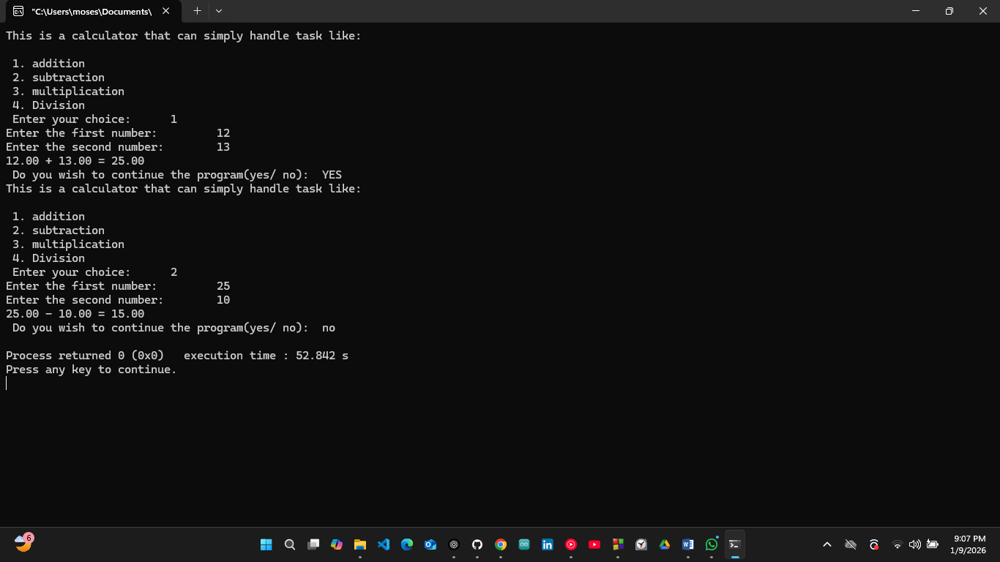

# Math Functions Header – C Project

## Overview
This project is focused on learning how header files work in C programming. The main idea is to separate code into a main file, a header file, and a source file so functions can be reused in other projects.

## Project Description
In this project, I built a simple calculator using header files. Instead of writing everything inside the main file, the math functions are declared in a header file and implemented in a source file. The main file handles user input and program flow.

The goal of this project is to understand how multiple files work together in C and how header files make code cleaner and reusable.

## Project Structure
- main.c → handles user input, menu, and program flow [Click Here For the Link](source_code/main.c)
- math_ops.h → contains function declarations and macros [Click Here For the Link](header_file/math_op_.h)
- math_ops.c → contains the actual math function logic [Click Here For the Link](source_code/math_op_.c)

## Why Header Files
I used header files so the math functions can be reused in other projects without rewriting the code. The header file uses include guards (#ifndef, #define, #endif) to prevent multiple declarations.

At first, the program was not working properly because the header and source files were not correctly connected. Fixing this helped me understand how important file linking is in C.

## How the Code Works (Code Flow)
- The program starts execution from the main() function.
- Standard C libraries and the custom math header file are included.
- The header file provides declarations for arithmetic functions.
- A calculator menu is displayed to the user.
- The user selects an operation and enters two numbers.
- Based on the selected option, the corresponding math function is called.
- The function performs the calculation and prints the result.
- Before division, the program checks to avoid division by zero.
- The user is asked if they want to run the program again.
- If yes, the program repeats; otherwise, it ends.

## What I Learned
- How to create and use header files in C
- How to separate declarations and definitions
- How main, header, and source files work together
- Why include guards are important
- How to write reusable code

## images/Demo Video

[Click Here For The Video](videos/Maths_Function_Header_project_on_9th_January_2026.mp4)

## Embedded Systems Connection
In embedded systems, header files help organize code for specific tasks. For example, a countdown timer function can be placed in a header and reused in projects like a washing machine system, where washing and drying cycles need different timing logic.
